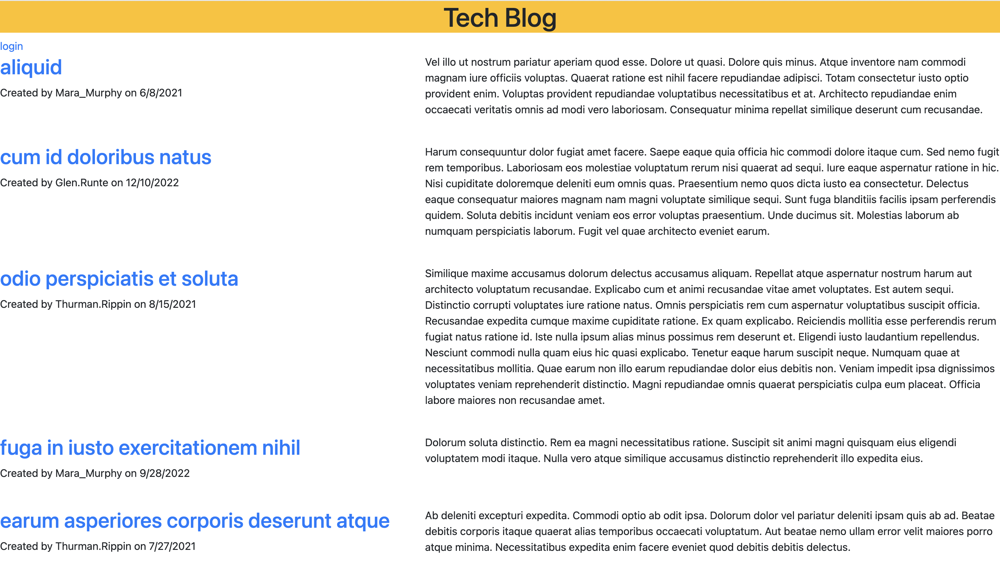

<h1>techBlog</h1>

## Table of Contents

  * [Description](#description)

  * [Usage](#usage)

  * [Links](#links)

  * [Questions](#questions)

## Description

- My motivation was to create this tech blog so that a user could post and edit comments onto the tech blog.
- I built this project to learn more about running seeds and expand my knowledge in javasript and node.js and become more efficient using routes.
- It allows user to create posts in a blog and view posts from other users. 
- Learned how to write schema.sql and seeds.sql and db.query to manipulate database files. 

## Usage
  
 - Go to application url, create an account an account.
 - Create post in Dashboard, able to edit posts after being created, and can view other users posts in Homepage.
    
 

## Links

- GitHub: https://github.com/Caliza/techBlog 
- heroku: https://arcane-stream-71577.herokuapp.com/

## Questions

- For any additional questions on usage of application, please contact at rances.rodriguez@gmail.com.